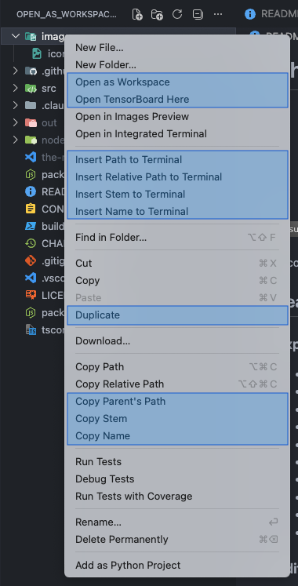

# The Missing Menu

  

A collection of useful context menu commands for VS Code explorer and editor that you never knew you needed.

## Features

### Explorer Context Menu

- **Sort Order** - Choose explorer file/folder sort order from a submenu (Default, Mixed, Folders First, Files First, By Type, By Modified, By Created)
- **Open as Workspace** - Open any folder as a new VS Code workspace window
- **Open TensorBoard Here** - Launch TensorBoard directly from the explorer with automatic port detection
- **Duplicate** - Copy files/folders with a new name (preserves symlinks)
- **Copy Parent's Path** - Copy the parent directory path to clipboard
- **Copy Stem** - Copy filename without extension to clipboard
- **Copy Name** - Copy full filename to clipboard
- **Insert Path to Terminal** - Send full path to active terminal
- **Insert Relative Path to Terminal** - Send workspace-relative path to terminal
- **Insert Stem to Terminal** - Send filename stem to terminal
- **Insert Name to Terminal** - Send filename to terminal

### Editor Title Context Menu

All the copy/insert commands above, plus:

- **Select for Compare** - Mark a file for comparison
- **Compare with Selected** - Diff the current file against the previously selected file

## Installation

### From VS Code Marketplace

1. Open VS Code
2. Press `Ctrl+P` / `Cmd+P`
3. Type `ext install the-missing-menu`

### Manual Installation

1. Download the `.vsix` file from [Releases](https://github.com/winlaic/the-missing-menu/releases)
2. Open VS Code
3. Press `Ctrl+Shift+P` / `Cmd+Shift+P`
4. Type "Install from VSIX"
5. Select the downloaded file

## Usage

Right-click on any file or folder in the VS Code Explorer or Editor title bar to access the new commands.

## Requirements

- VS Code 1.74.0 or higher

## Screenshot

  

## License

MIT